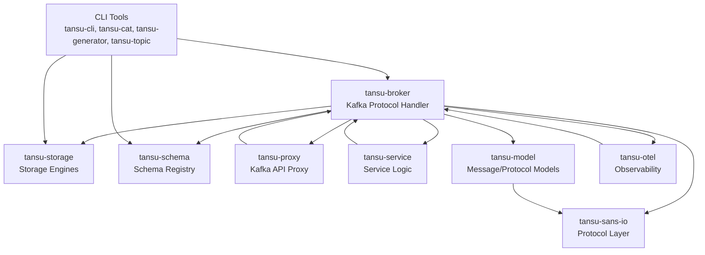

# Contributing to Tansu

Tansu is a modular Rust project implementing a drop-in replacement for Apache Kafka. It provides a Kafka-compatible broker with support for multiple storage backends (PostgreSQL, S3, memory), schema validation (Avro, JSON, Protobuf), and data lake integration (Apache Iceberg, Delta Lake, Parquet).

## Key Components

- **Broker** (`tansu-broker/`):
  Implements the Kafka protocol, handling requests such as produce, fetch, topic management, transactions, and more. Uses a builder pattern for configuration.

- **Sans-IO Protocol Layer** (`tansu-sans-io/`):
  Contains protocol message definitions, codecs, and tests for Kafka wire compatibility. Handles serialization/deserialization of Kafka messages and flexible versions.

- **Storage Engines** (`tansu-storage/`):
  Provides pluggable storage backends, including PostgreSQL, S3, and in-memory storage.

- **Schema Registry** (`tansu-schema/`):
  Supports topic schemas for message validation.

- **CLI Tools**:
  - **tansu-cli/**: Main CLI entrypoint.
  - **tansu-cat/**: Produce/consume messages, validate against schemas.
  - **tansu-generator/**: Generate fake data for topics.
  - **tansu-topic/**: Topic administration.

- **Proxy** (`tansu-proxy/`):
  Kafka API proxy.

- **Service** (`tansu-service/`):
  Additional service logic.

- **Model** (`tansu-model/`):
  Message and protocol model definitions.

**Observability** (`tansu-otel/`):
  OpenTelemetry integration.

## Codebase Architecture (Mermaid Diagram)

## Development setup

Development container has all the required dependencies. 

## Features
- **Kafka API Compatibility**:
  Implements Kafka wire protocol, supporting requests/responses as defined in `tansu-sans-io/message/README.md`.

- **Schema Validation**:
  Topics can be backed by Avro, JSON, or Protobuf schemas. Invalid messages are rejected.

- **Data Lake Integration**:
  Schema-backed topics can be written as Parquet files to S3 or local storage, and queried with DuckDB.

- **Flexible Storage**:
  Switch between S3, PostgreSQL, or memory by changing the storage engine URL.

- **Testing & Benchmarks**:
  Extensive protocol tests (`tansu-sans-io/tests/`), integration tests (`tansu-broker/tests/`), and benchmarks (`tansu-sans-io/benches/`).

- **Configuration**:
  Uses environment variables and `.env` files for configuration (`example.env`).

## Usage

- Start the broker with the `tansu` binary.
- Use CLI tools for topic management, producing, and consuming messages.
- Integrate with existing Kafka clients and tools.

For more details, see the `README.md` and module-specific documentation.
